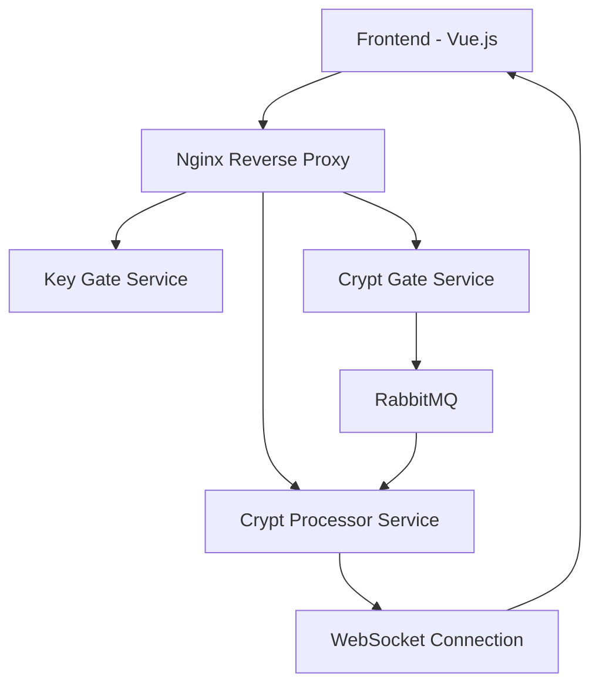

# Crypt-App: Güvenli Şifreleme Servisi

Crypt-App, modern web teknolojileri kullanılarak geliştirilmiş, güvenli şifreleme ve şifre çözme işlemlerini gerçekleştiren bir mikroservis uygulamasıdır.

## Sistem Mimarisi

## Servis Yapısı

### Frontend (Port: 5173)
- Vue.js 3 tabanlı SPA
- Composition API kullanımı
- PrimeVue UI framework entegrasyonu
- WebSocket bağlantı yönetimi
- Token bazlı kimlik doğrulama

### Key Gate (Port: 8082)
- Kimlik doğrulama servisi
- JWT token yönetimi
- Rust/Actix-web framework
- RESTful API endpoints

### Crypt Gate (Port: 8081)
- Şifreleme isteklerini karşılayan API
- RabbitMQ producer
- Asenkron işlem yönetimi
- Rust/Actix-web framework

### Crypt Processor (Port: 8083)
- WebSocket sunucusu
- RabbitMQ consumer
- Şifreleme/çözme işlemleri
- Asenkron mesaj işleme

## İletişim Akışı

### Kimlik Doğrulama
1. Frontend -> Nginx -> Key Gate
2. JWT token dönüşü
3. Token ile yetkilendirme

### Şifreleme İşlemi
1. Frontend -> Nginx -> Crypt Gate
2. Crypt Gate -> RabbitMQ
3. RabbitMQ -> Crypt Processor
4. Crypt Processor -> WebSocket -> Frontend

## Teknoloji Yığını

### Backend
- Rust
- Actix-web
- RabbitMQ
- WebSocket
- JWT

### Frontend
- Vue.js 3
- Vite
- PrimeVue
- WebSocket API
- Pinia (State Management)

### DevOps
- Nginx (Reverse Proxy)
- Shell Script (Deployment)
- Docker (Container)

## Güvenlik Özellikleri
- CORS yönetimi (Nginx seviyesi)
- JWT tabanlı kimlik doğrulama
- WebSocket güvenli bağlantı
- Servis izolasyonu
- Rate limiting

## Geliştirme Ortamı

### Kurulum Gereksinimleri
- Rust
- Node.js & pnpm
- RabbitMQ
- Nginx
- netcat

### Başlatma
bash
./dev-start.sh

Bu script:
- Tüm servisleri paralel başlatır
- Port çakışmalarını kontrol eder
- Bağımlılıkları doğrular
- Servislerin hazır olmasını bekler
- Frontend'i başlatır
- Nginx'i yapılandırır

## Mesajlaşma Sistemi
- RabbitMQ kuyruklama
- WebSocket real-time iletişim
- Asenkron işlem takibi
- Hata yönetimi ve retry mekanizması

## Ölçeklenebilirlik
- Mikroservis mimarisi
- Bağımsız servis ölçeklendirme
- Yük dengeleme hazırlığı
- Stateless servis tasarımı